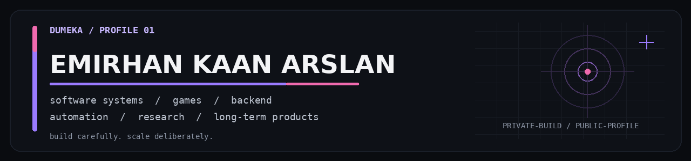

  

  <strong>Building software as systems — not disposable demos.</strong>

 

01 / Profile

I build long-term software projects where architecture, maintainability and automation matter as much as making the feature work.

My work currently spans game development, backend systems, content intelligence, learning products and quantitative research. Most larger projects stay private while they evolve toward their intended full scope.

 

02 / Selected Work

01 — Sinkfall

GAME SYSTEMS / UNITY / C#

FPS Roguelike Dungeon Crawler

A PC-first roguelike built around depth-based progression, replayable runs and interconnected gameplay systems. The architecture is designed for continued expansion rather than a short prototype cycle.

Unity 6 · C# · Gameplay Systems · Roguelike

 

02 — ChannelSentry

CONTENT INTELLIGENCE / AUTOMATION

Autonomous YouTube Content Intelligence

A research and automation system built around a Fortnite-focused YouTube channel. It collects and structures source, competitor and ecosystem activity, then turns that information into signals for content research and decision-making.

Python · FastAPI · PostgreSQL · YouTube Data · Automation

 

03 — Lexumi

LEARNING PRODUCT

Interactive English Learning Platform

An English-learning product built around structured progression and interactive practice, designed as one cohesive learning system rather than a collection of disconnected exercises.

Learning Systems · Product Development · Web

 

04 — Rigorant

QUANT RESEARCH / CRYPTO

Quantitative Strategy Research & Validation

A local-first research platform built to answer a harder question than “did this backtest make money?” — does the strategy actually have a durable edge?

Rigorant combines provenance-aware market data, causal testing, protected validation and holdouts, realistic futures execution simulation and paper decision support.

Python · SQLite · Parquet · WebSockets · CCXT · Quant Research

 

03 / Working With

Area

Stack

Languages

Python · C# · TypeScript · JavaScript · SQL · HTML · CSS

Game

Unity 6

Backend / Data

FastAPI · PostgreSQL · SQLite · Parquet

Workflow

Git · GitHub · Docker · VS Code

Systems

WebSockets · data pipelines · automation · research tooling

 

04 / Focus

Game systems — gameplay architecture, progression and maintainable content systems
Backend engineering — APIs, data models and background workflows
Automation — reducing repetitive work without losing observability or control
Data & research — turning fragmented data into defensible decisions
Developer tooling — workflows that make iteration and debugging more reliable

 

  DUMEKA

