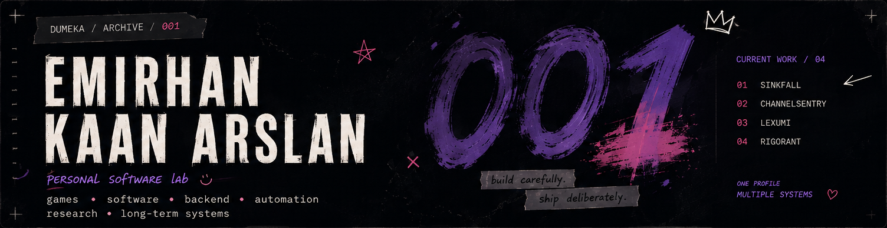
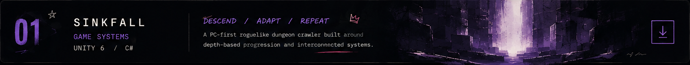
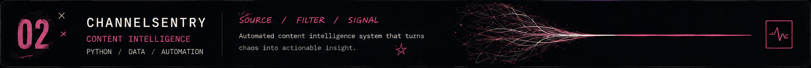
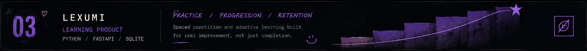
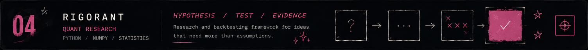

  

 

## 01 / Profile

I turn ideas into working products and systems with **AI coding tools**.

I focus on deciding **what to build, how it should behave, how different systems should fit together, and how the project should evolve over time**. I use AI coding agents for implementation while I guide the direction, review results, test behavior and iterate on the product.

My projects currently span **games, automation, content intelligence, learning products and quantitative research**.

 

## 02 / Selected Work

  

**FPS Roguelike Dungeon Crawler**

A PC-first roguelike built around depth-based progression, replayable runs and interconnected gameplay systems. Its architecture is designed for continued expansion rather than a short prototype cycle.

Unity 6 · C# · Gameplay Systems · Roguelike

 

  

**Autonomous YouTube Content Intelligence**

A research and automation system built around a Fortnite-focused YouTube channel. It collects and structures source, competitor and ecosystem activity, then turns that information into signals for content research and decision-making.

Python · FastAPI · PostgreSQL · YouTube Data · Automation

 

  

**Interactive English Learning Platform**

An English-learning product built around structured progression and interactive practice, designed as one cohesive learning system rather than a collection of disconnected exercises.

Learning Systems · Product Development · Web

 

  

**Quantitative Strategy Research & Validation**

A local-first research platform built to answer a harder question than “did this backtest make money?” — **does the strategy actually have a durable edge?**

Rigorant combines provenance-aware market data, causal testing, protected validation and holdouts, realistic futures execution simulation and paper decision support.

Python · SQLite · Parquet · WebSockets · CCXT · Quant Research

 

## 03 / Technologies Used

Tools and technologies currently used across my projects.

| Area | Technologies |
| --- | --- |
| **Game** | Unity 6 · C# |
| **Backend & Data** | Python · FastAPI · PostgreSQL · SQLite |
| **Web** | TypeScript · JavaScript · HTML · CSS |
| **Workflow** | Git · GitHub · Docker · VS Code |
| **AI-assisted development** | Coding agents · automation · iterative testing |

 

## 04 / Current Interests

**Product & system design** — turning rough ideas into structured projects  
**Game systems** — gameplay, progression and long-term content structure  
**AI-assisted development** — directing coding agents through implementation and iteration  
**Automation** — reducing repetitive work through reliable workflows  
**Research systems** — structuring information, testing ideas and supporting better decisions

 

  

